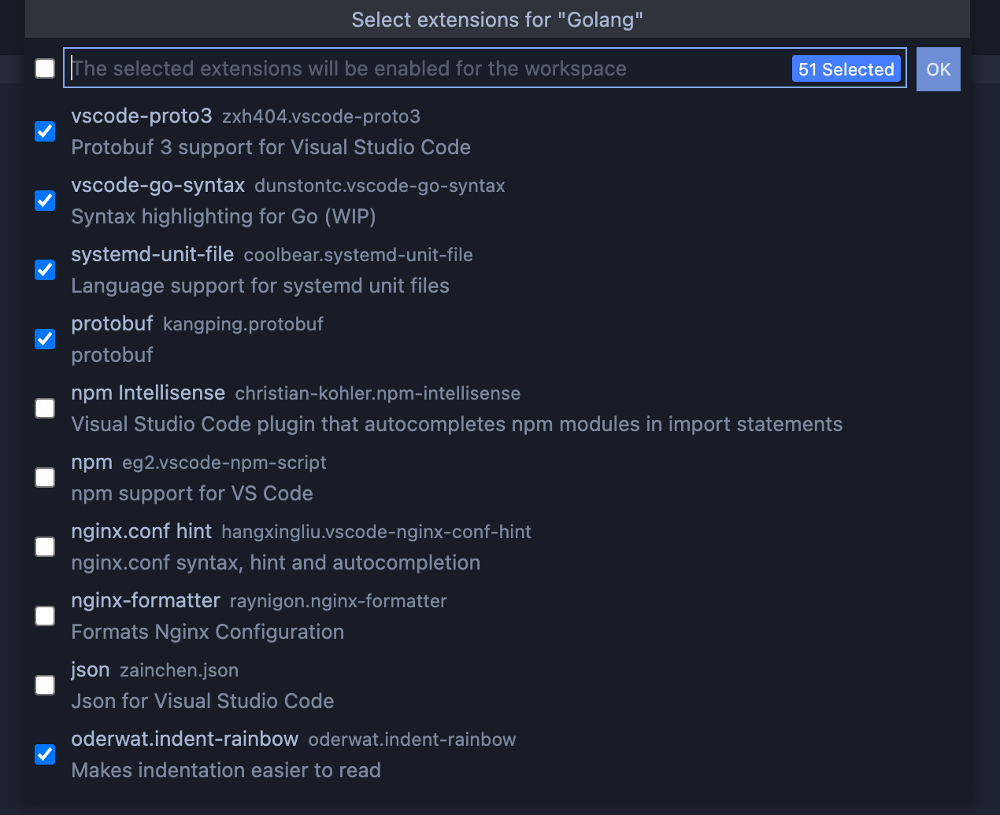
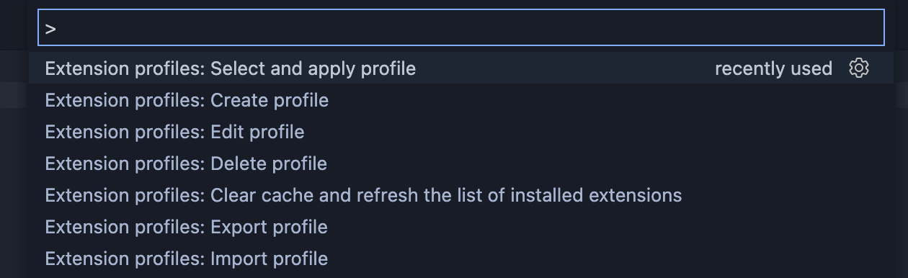

# Extension profiles for VSCode

Lets you create profiles to include the selected extensions in the desired project.

Do you often have to work with different projects and different technologies?

<!-- https://user-images.githubusercontent.com/10986227/122539241-34165180-d049-11eb-8a35-dbd3402e991f.mp4 -->

Quickly and conveniently create profiles with the necessary extensions for working with various technologies.

Apply a profile to a folder or workspace with a single command!

## Further development

Explanation: 💡 - pending, ⚙️ ️- in progress, ❌ - cancelled, ✅ - done

My thoughts:

- 💡 Apply a profile to a set of selected workspaces;
- ✅ Global profile;
- ✅ Import selected profiles;
- 💡 Multiple apply of profiles;
- 💡 After installing new extensions, automatically add to the list of disabled extensions not specified in the profile;
- 💡 Linking the project to the profile (notification and application of changes when changing the profile);
- 💡 Recommendations for installing missing extensions;
- 💡 Convenient management of extensions for a separate project without linking to a profile or creating it;
- 💡 Create a profile from the current or selected project;
- 💡 Multiply delete profiles.

I invite you to discuss these thoughts and suggestions in this issue: [Do I need additional functionality?](https://github.com/evald24/vscode-extensions-profiles/issues/1)
